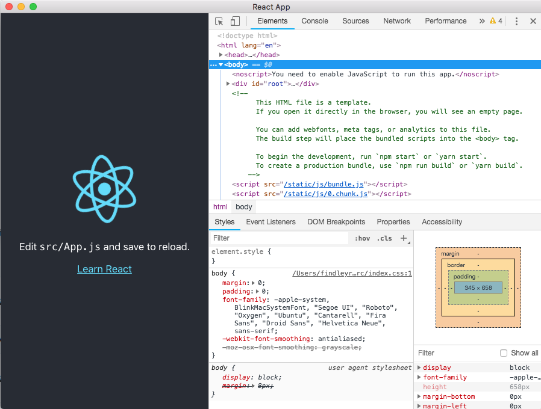

# Use Electron with a {Create-React-App} project

This document describe the needed steps to add Electron to an existing `Create-React-App`.

## Process of adding Electron

### Create or select a project

- If the project already exists then use the following:
  `cd <path-to-your-project>`

- Create a new project
  
  - Install the `create-react-app` module globally: `yarn global add create-react-app`
  - Generate new project: `yarn create react-app <your-app-name>` or `create-react-app <your-app-name>`
  - Make sur the project is working: `yarn start` or `npm start`

### Electron Setup

Now that we're sure that we have a working project, we should start adding `Electron` to the app.

#### Install the Dev dependencies

`yarn add electron electron-builder wait-on concurrently cross-env --dev`

- **[electron](https://www.npmjs.com/package/electron)**: The Electron framework.
- **[electron-builder](https://www.npmjs.com/package/electron-builder)**: Solution to package and build a ready for distribution `Electron` app for windows, macOs and Linux.
- **[wait-on](https://www.npmjs.com/package/wait-on)**: wait-on is a cross-platform command line utility which will wait for files, ports, sockets, and http(s) resources to become available.
- **[concurrently](https://www.npmjs.com/package/concurrently)**: Run multiple commands concurrently. Like npm run watch-js & npm run watch-less but better. [ex: `concurrently "command1 arg" "command2 arg"`].
- **[cross-env](https://www.npmjs.com/package/cross-env)**: Run scripts that set and use environment variables across platforms.

#### Install dependencies

`yarn add electron-is-dev about-window`

- **[about-window](https://www.npmjs.com/package/about-window)**: provides `About This App` window for `Electron` applications. Takes most of the informations from the `package.js`.
- **[electron-is-dev](https://www.npmjs.com/package/electron-is-dev)**: Check if Electron is running in development.

#### Create Electron entry point

Create a new file, `public/[electron | main | <name>].js`, with the following contents.

```JS
const {
    app,
    BrowserWindow,
    Menu
} = require("electron");

const os = require('os');
const path = require('path');
const isDev = require('electron-is-dev');

// About this app window.
const openAboutWindow = require('about-window').default;

// Custom Variables.
const APP_CONTENT_DEV = 'http://localhost:3000';
const APP_CONTENT_PROD = `file://${path.join(__dirname, '../build/index.html')}`;
const APP_ICON = `${__dirname}/favicon.ico`;
const APP_PNG = `${__dirname}/logo.svg`;
const REACT_DEV_TOOL_URL = path.join(os.homedir(),'/AppData/Local/Google/Chrome/User Data/Profile 2/Extensions/fmkadmapgofadopljbjfkapdkoienihi/4.6.0_0');

// Electron Main window.
let mainWindow;

// Electron Menu bar.
let menu_bar = new Array();

// Initial method.
function createWindow() {

  mainWindow = new BrowserWindow(getWindowOptions());
  
  // Load the Project depending on the environment.
  mainWindow.loadURL(isDev
    ? APP_CONTENT_DEV
    : APP_CONTENT_PROD);

  // Custom Menu.
  registerFileMenu();
  registerEditMenu();
  registerHelpMenu();
  Menu.setApplicationMenu(Menu.buildFromTemplate(menu_bar));

  mainWindow.on('closed', () => mainWindow = null);
}

/**
 * Set the Electron window options.
 */
function getWindowOptions(){
  const windowWidth =  isDev ? 1500 : 900;

  return {
    title: "Convert and download video as MP3 or MP4.",
    width: windowWidth,
    height: 680,
    maximizeable: false,
    icon: APP_ICON,
    webPreferences: {
      nodeIntegration: true,
    },
  };
}

/* ==================== REGISTER MENUS ================= */
function registerFileMenu(){
  menu_bar.push({
    label: "File",
    submenu: [
      { type: "separator" },
      {
        label: "Quit",
        accelerator: "CmdOrCtrl+shift+Q",
        click: function () {
          app.quit();
        },
      },
    ],
  });
}

function registerEditMenu(){
  menu_bar.push({
    label: "Edit",
    submenu: [
      { role: "Reload", accelerator: "CmdOrCtrl+R", selector: "reload:" },
      { role: "Undo", accelerator: "CmdOrCtrl+Z", selector: "undo:" },
      { role: "Redo", accelerator: "CmdOrCtrl+Y", selector: "redo:" },
      { type: "separator" },
      { role: "Cut", accelerator: "CmdOrCtrl+X", selector: "cut:" },
      { role: "Copy", accelerator: "CmdOrCtrl+C", selector: "copy:" },
      { role: "Paste", accelerator: "CmdOrCtrl+V", selector: "paste:" },
    ],
  });
}

function registerHelpMenu(){
  menu_bar.push({
    label: "?",
    submenu: [
      {
        label: "About",
        accelerator: "CmdOrCtrl+shift+A",
        click: () =>
          openAboutWindow({
            icon_path: APP_PNG,
            copyright: `Copyright (c) ${new Date().getFullYear()} - Video Converter`,
            package_json_dir: `${__dirname}/..`,
            license: `${__dirname}/../LICENSE.md`,
            css_path: path.join(__dirname, '/about.css'),
            win_options: {
              width: 600,
              height: 450,
              maximizeable: false,
              resizable: false,
              minimizable:false,

              parent: mainWindow,
              modal: true,
            }
          }),
      },
      { type: "separator" },
      {
        label: "Open Dev Tools",
        click: () => {
          mainWindow.webContents.openDevTools();
        },
        accelerator: "CmdOrCtrl+shift+i",
      }
    ],
  });

  // Automatically open the dev tool if it's dev environment.
  if (isDev) {
    // BrowserWindow.addDevToolsExtension(REACT_DEV_TOOL_URL);
    mainWindow.webContents.openDevTools();
  }
}

/* ================= SET APP LISTENERS ================= */
app.on('ready', createWindow);

app.on('window-all-closed', () => {
  if (process.platform !== 'darwin') {
    app.quit();
  }
});

app.on('activate', () => {
  if (mainWindow === null) {
    createWindow();
  }
});
```

#### Configuration

In the `public/index.html` add following in the `HTML head` tag:

- `<meta http-equiv="Content-Security-Policy" content="script-src 'self' 'unsafe-inline'" />`

In the `package.json` add the following:

```js
{
    ...

    "main": "public/[electron | main | <name>].js",
    "scripts": {
      ...
      "start": "cross-env BROWSER='none' react-scripts start",
      "run-dev": "concurrently \"yarn start\" \"wait-on http://localhost:3000 && electron .\"",

        //  Before running this command, you need to make sur that the command `yarn start` was executed before.
      "start-electron": "electron ."
      ...
    }

    ...
}
```

#### Testing

Now that the configuration setup is done, we need to check that the project runs.

```Bash
## Run the React app and electron at the same time.
yarn run

Or

## Run the React App first
yarn start

## Once th eprevious script finished. Run Electron.
yarn start-electron
```

You should have somthing like the following.



## Custom Configuration

If ever you have the need to add more configuration to the `Create-react-app`, and you don't want to eject. Use the following:

- Install `rescripts` allows you to add more configuration without having to eject.

```bash
yarn add @rescripts/cli @rescripts/rescript-env --dev
```

- In your `packag.json` replace `react-scripts` with `rescripts` as follow:

```diff
{
  ...

  "scripts": {
-   "start": "cross-env BROWSER='none' react-scripts start",
+   "start": "cross-env BROWSER='none' rescripts start",
-   "build": "react-scripts build",
+   "build": "rescripts build",
-   "test": "react-scripts test",
+   "test": "rescripts test",
-   "eject": "react-scripts eject"
  },
  
  ...
}
```

- Add a new file `.rescriptsrc.js` with the following contents:

```JavaScript
module.exports = [require.resolve('./.webpack.config.js')]
```

- Add another new file `.webpack.config.js` with the following contents:

```JavaScript
// define child rescript
module.exports = config => {
  config.target = 'electron-renderer';
  return config;
}
```

## Building and Packaging your App

- Install the `Electron Builder` and `Typescript`

```bash
yarn add Electron Builder Typescript --dev
```

- Make sure that the field `homepage` is as follow:

```js
{
  ...
  "author":{
    "name":"Youssef Benhessou",
    "url": "https://github.com/Youssef-ben/video-converter"
  },
  "homepage": "./",
  ...
}
```

- Add `Build` field and the `scripts to package` the app in the `Package.json` as follow:

```js
{
  ...

  "scrits":{
    ...
    // Add the override the main of the {package.json} to point to {build/[electron | main | <name>].js},
    "pack-electron": "yarn build & electron-builder build --win -c.extraMetadata.main=build/electron.js --publish never",
    "postinstall-electron": "electron-builder install-app-deps"
  }
  ...,
  "build": {
    "appId": "<app.id>",
    "productName": "<product name>",
    "icon": "build/<logo.png>",
    "mac": {
      "category": "public.app-category.utilities"
    },
    "files": [
      "build/**/*",
      "node_modules/**/*"
    ],
    "directories": {
      "buildResources": "assets"
    }
  }
}

```

- Finally, you can run the command to check if the packaging works.

```bash
yarn pack-electron
```
